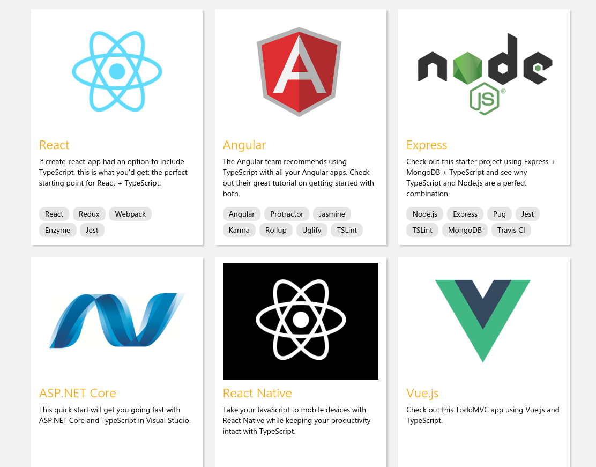

## Typescript
### An IP EDU Presentation

Michael Aras Sila

Software Engineer

---

# Overview  
* What Is Typescript
* Problems with Javascript
* Features 
* Developing in Typescript
* Real World Applications

---

# What Is Typescript 

Note: Image of TS Logo

---

> TypeScript is a language for application-scale JavaScript. TypeScript adds optional types, classes, and modules to JavaScript. TypeScript supports tools for large-scale JavaScript applications for any browser, for any host, on any OS. TypeScript compiles to readable, standards-based JavaScript.

Defaults to ES3 
<!-- .element: class="fragment" data-fragment-index="1" -->

---

# Issues with Javascript 

Note: What issues are there with javascript

---

## Atwood's Law

 > Any application that can be written in javascript will be eventually written in Javascript
<!-- .element: class="fragment" data-fragment-index="1" -->

---

## Javascript has completeley outgrown its original use case

---

# Features of Typescript

---

### Strict Typing 

 * Typescript lets you define a type of a variable, and will throw COMPILE TIME errors if that contract is broken

---

### Classes

---

<pre>
<code>
class Employee 
{    
    private _fullName: string;

    get fullName(): string {
        return this._fullName;
    }

    set fullName(newName: string) {
         this._fullName = newName;
    }

    public greet() : string {
        return "Hello!";
    }
}
</code>
</pre>

---

### Interfaces

---

<pre>
<code>
interface Version
{
    name: string;
    svnLocation? : scmLocation;
    release: boolean;
    releaseBranch() : void;
} 
</code>
</pre>

---

### Functions

<pre>
<code>
function buildTitle(minor: string, major = "Presentation") : string {
    return minor + " - "+major;
}
</code>
</pre>

---

### Modules and Namespaces
* Modules control what is seen by other classes/files
* Modules are executed within their own scope
* Namespaces are like packages in java

---

### ...And That's just the begginning 

Enums, Generics, Type  Inference, IDE Autocomplete, and Much More Supported
<!-- .element: class="fragment" data-fragment-index="1" -->

---

# Developing in Typescript

---

### The Typescript Compiler
* Simplest way to get started with typescript
* Also fairly useless without other tools

---

<pre>
<code>
tsc helloWorld.ts
</code>
</pre>

---

### Angular (w. NPM)
* Will automatically compile .ts files to javascript
* Will generate new .ts files 
* Will automatically recompile on code change

---

<pre>
<code>
npm install -g @angular/cli
ng new sila-application
cd sila-application
ng serve
</pre>
<code>

---

### NodeJS

---

<pre>
<code>
npm install typescript --save-dev
npm install @types/node --save-dev
npx tsc --init
// package.json 
"scripts": {
  "start": "npm run build:live",
  "build:live": "nodemon --exec ./node_modules/.bin/ts-node -- ./index.ts"
},
</pre>
<code>

---

### Much More

---

---

# Real World Applications

---

## Hypothetical Project : "Development Manager"

* Used to deploy projects 
* Used to manage versions and cut releases 
* Store for a massive amount of information relating to company's workflow process

---

## How Would Typescript Help

---

### Parameters in Common Methods

* Service class that is expecting data to be passed in as certain format
* Service class that is making an endpoint call

---

### Common Objects

* Data models that are used throughout "Development Manager"
* Useful for understanding data types
* Useful for common functionality
* Useful for tests

---

### Just Plain Easier

* More Organized
* More Structured 
* Easier to Understand
* Easier to Maintain

--- 

# Questions
